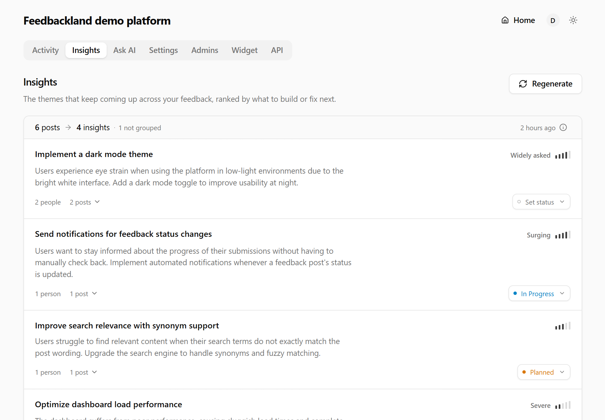

<div align="center">

# Feedbackland

**An open-source feedback board that tells you what to build next.**

<p>
  Open-source. MIT licensed. Self-hostable. Free forever.
</p>

<p>
  <a href="LICENSE"></a>
  <a href="https://github.com/feedbackland/feedbackland/releases"></a>
  <a href="https://www.npmjs.com/package/feedbackland-react"></a>
  <a href="https://github.com/feedbackland/feedbackland/stargazers"></a>
</p>

<p>
  <a href="https://demo.feedbackland.com"><b>Live demo →</b></a> ·
  <a href="https://get-started.feedbackland.com">Create a board</a> ·
  <a href="SELFHOSTING.md">Self-host</a>
</p>

<br>

<picture>
  <source media="(prefers-color-scheme: light)" srcset="screenshots/insights_light_mode.png">
  
</picture>

</div>

## Why

Feedback boards are easy to launch and hard to keep. Posting is a form, so people quit halfway. What does land is thirty posts describing the same problem thirty ways, and reading them all is an afternoon that never gets scheduled. Six months in, the board is an archive.

Feedbackland works on both ends of that:

- **Posting is one text box.** No title field, no category picker — the title gets written for you, the post gets filed as idea, issue or general feedback, and spam (text *and* images) is screened out before it lands. Users sign in with Google, Microsoft or email — or post anonymously.
- **Reading is a ranked list.** *Insights* merges posts that ask for the same thing ("dark mode", "night theme", "black background" → one theme) and ranks every theme by how many people are behind it, how fast it's growing, and how much the problem hurts. Click a score and the arithmetic opens up — you can check it, and you can disagree with it.
- **Closing the loop is one click.** Set *planned*, *in progress* or *done* on an insight and every post behind it updates. Ask AI answers plain-English questions about your feedback. Search works by meaning, so "can't log in" finds "auth times out".

## Getting feedback in

Three doors, one board.

**1 · The widget** — your whole board in a drawer inside your app, or a minimal popover form (`widget="popover"`).

```bash
npm install feedbackland-react
```

```tsx
import { FeedbackButton } from "feedbackland-react";

<FeedbackButton platformId="your-platform-id" />;
```

That's the whole integration — no CSS import, no provider, no backend of yours to run. Restyle the button or swap in your own. ~110 KB gzipped · React 17–19 · SSR-safe · styles isolated both ways · [all props →](feedbackland-react/README.md)

**2 · The board** — every board lives at its own URL (`you.feedbackland.com` hosted, or your own domain), with upvotes, threaded comments and statuses built in.

**3 · The API** — `POST` one public endpoint to pipe feedback in from Slack, a support inbox, a CLI, anywhere:

```bash
curl -X POST https://api.feedbackland.com/api/feedback/create \
  -H "Content-Type: application/json" \
  -d '{"orgId": "your-platform-id", "description": "We need a dark mode option."}'
```

## Run it

| | |
| --- | --- |
| **Demo** — full admin, no signup | [demo.feedbackland.com](https://demo.feedbackland.com) |
| **Hosted** — a board in about a minute | [get-started.feedbackland.com](https://get-started.feedbackland.com) |
| **Self-host** — Vercel + Supabase + Firebase, ~15 min | [SELFHOSTING.md](SELFHOSTING.md) |

Hosted and self-hosted run the same code. Nothing is feature-gated, nothing is priced per seat.

## Not there yet

No email notifications, no webhooks, no changelog — collecting and ranking came first. [Open an issue](https://github.com/feedbackland/feedbackland/issues) if one of these should come next.

## License

[MIT](LICENSE) — fork it, run it, own it.
