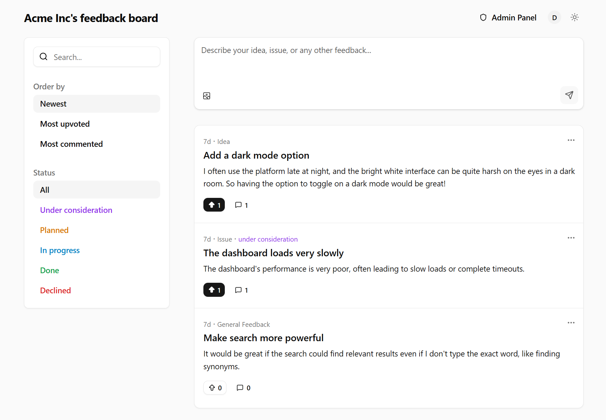

<div align="center">

# Feedbackland

**An open-source feedback board that tells you what to build next.**

<p>Drop the widget into your app in a minute. MIT licensed, free, never priced per user.</p>

<p>
  <a href="LICENSE"></a>
  <a href="https://github.com/feedbackland/feedbackland/releases"></a>
  <a href="https://www.npmjs.com/package/feedbackland-react"></a>
  <a href="https://github.com/feedbackland/feedbackland/stargazers"></a>
</p>

<p>
  <a href="https://demo.feedbackland.com"><b>Live demo →</b></a> ·
  <a href="https://get-started.feedbackland.com">Create a board</a> ·
  <a href="SELFHOSTING.md">Self-host</a>
</p>

<br>

<picture>
  <source media="(prefers-color-scheme: dark)" srcset="screenshots/homepage_dark_mode.png">
  
</picture>

</div>

---

## Why

- **Know what to build next — without reading 200 posts.** Duplicates merge into themes, ranked by how many people, how urgent, how recent. Open a score and you see the arithmetic, so you can disagree with it.
- **Never a bill that grows with you.** MIT, no paid tier, no feature gates. Familiar shape if you've used Canny or Fider — but nothing is priced per user, and you can fork it.
- **Every channel in one list.** `POST` one endpoint to pipe feedback in from Slack, a support inbox or a CLI.

## The widget

```bash
npm install feedbackland-react
```

```tsx
import { FeedbackButton } from "feedbackland-react";

<FeedbackButton platformId="your-platform-id" />;
```

That's the whole integration — no CSS import, no provider, no backend.

- **Two flavors.** A **drawer** holding your full board, or a **popover** with just a submit form — `widget="popover"`.
- **Looks like yours.** Variants and sizes, your own Tailwind classes, or `asChild` to pass your own button.
- **~110 KB gzipped** · React 17–19 · SSR-safe · styles isolated both ways · [all props →](feedbackland-react/README.md)

## Run it

| | |
| --- | --- |
| **Demo** — full admin, no signup | [demo.feedbackland.com](https://demo.feedbackland.com) |
| **Hosted** — a board in about a minute | [get-started.feedbackland.com](https://get-started.feedbackland.com) |
| **Self-host** — Vercel + Supabase + Firebase, ~15 min | [SELFHOSTING.md](SELFHOSTING.md) |

Same code either way. Upvotes, comments, statuses, admin panel, anonymous or Google/Microsoft/email sign-in and dark mode are all there. Self-hosting needs an [OpenRouter](https://openrouter.ai) key for the AI features; the board works without one.

**Not yet:** no email notifications · no public changelog · young project, expect breaking changes. [Open an issue](https://github.com/feedbackland/feedbackland/issues) to shorten this list.

## License

[MIT](LICENSE) — fork it, run it, sell it.
