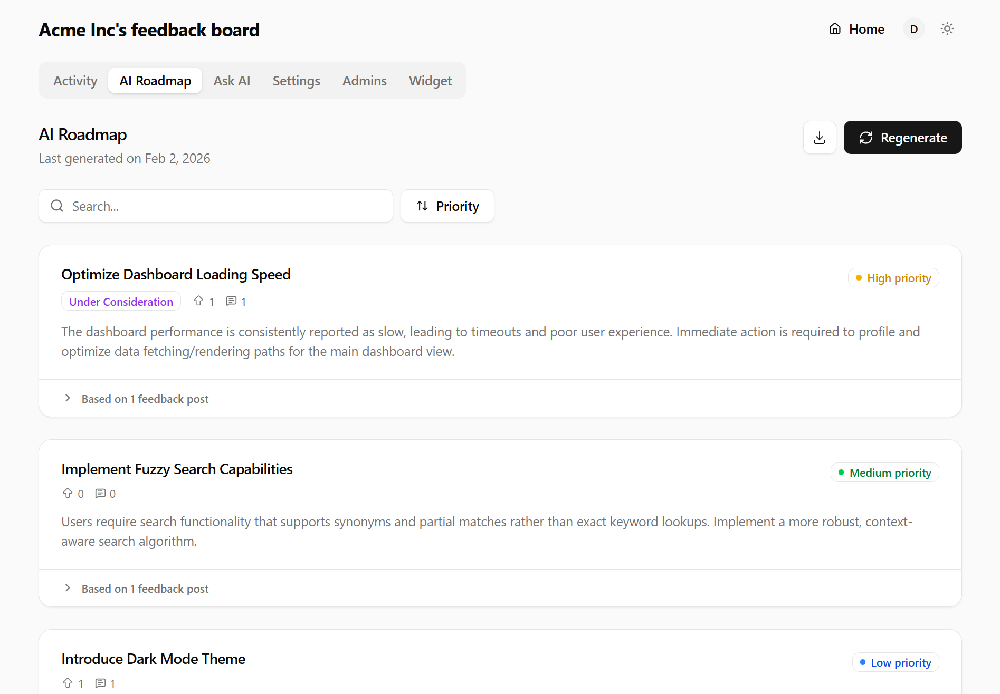
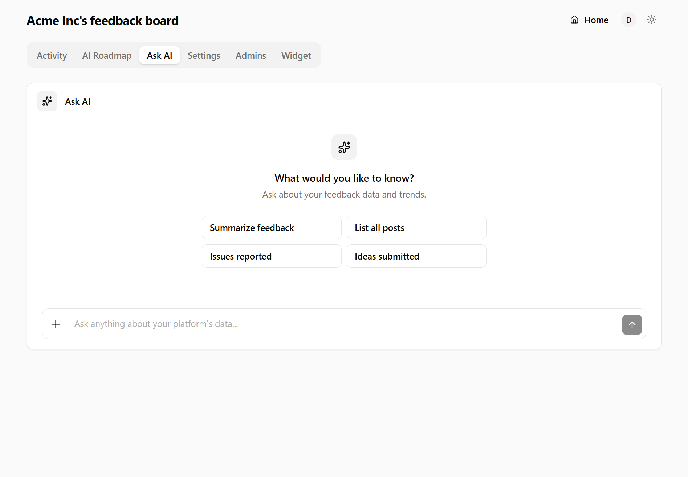

<div align="center">

# Feedbackland

**An open-source feedback board that triages itself.**

<p>
<div>Your users write one sentence. Feedbackland titles it, categorizes it,</div>
<div>merges the duplicates, and keeps a prioritized roadmap up to date.</div>
</p>

<p>
  <a href="LICENSE"></a>
  <a href="SELFHOSTING.md"></a>
  <a href="https://github.com/feedbackland/feedbackland/releases"></a>
  <a href="https://github.com/feedbackland/feedbackland/stargazers"></a>
</p>

<p>
  <a href="https://get-started.feedbackland.com"><b>Create your board →</b></a> ·
  <a href="https://demo.feedbackland.com">Live demo</a> ·
  <a href="SELFHOSTING.md">Self-host</a>
</p>

<br>

<picture>
  <source media="(prefers-color-scheme: dark)" srcset="screenshots/homepage_dark_mode.png">
  
</picture>

</div>

---

## The problem

Feedback tools are easy to install and hard to keep. Within a few months the board is a pile
of near-duplicate posts nobody has read, and turning it into a roadmap is an afternoon of
manual sorting that never happens.

Feedbackland does that sorting on every submission, automatically.

## What that means concretely

**Posting is one text box.** No title field, no category dropdown. The user describes the
problem; an LLM writes the title and files it as *idea*, *issue*, or *general feedback*. Fewer
fields means more people finish the form.

**The roadmap writes itself.** One click bundles posts that describe the same underlying need
("dark mode", "night theme", "black background" → *Add Dark Mode*) and scores each item 0–100
on severity, reach (upvotes + comments), and category. Up to 400 posts in, up to 50 prioritized
items out.

**You can ask questions.** *"What do people complain about most since the redesign?"* — answered
against every active post on your board, streamed.

**Search understands meaning.** Posts and comments are embedded into Postgres (`pgvector`), so
searching *"can't log in"* also surfaces *"auth times out"*.

**Spam never lands.** Text and any uploaded images are moderated at submission time and
rejected before they reach your board.

<table>
<tr>
<td width="50%">
<picture>
  <source media="(prefers-color-scheme: dark)" srcset="screenshots/ai_roadmap_dark_mode.png">
  
</picture>
<p align="center"><sub><b>AI roadmap</b> — duplicates merged, priority scored</sub></p>
</td>
<td width="50%">
<picture>
  <source media="(prefers-color-scheme: dark)" srcset="screenshots/ask_ai_dark_mode.png">
  
</picture>
<p align="center"><sub><b>Ask AI</b> — plain-English questions over your feedback</sub></p>
</td>
</tr>
</table>

## Three ways in

**1. Embeddable React widget** — users never leave your product.

```bash
npm install feedbackland-react
```

```tsx
import { FeedbackButton } from "feedbackland-react";

<FeedbackButton platformId="your-platform-id" />;
```

That's the whole integration — no CSS import, no provider. Two flavors: a slide-in **drawer**
holding your full board, or an anchored **popover** with a single submission form
(`widget="popover"`). ~110 KB gzipped, React 17/18/19, SSR-safe, styles isolated in both
directions.

> Full props reference, styling escape hatches, and accessibility notes:
> [`feedbackland-react/README.md`](feedbackland-react/README.md) · [npm](https://www.npmjs.com/package/feedbackland-react)

**2. A hosted board** at your own subdomain — public, linkable, works without the widget.

**3. A REST endpoint** — pipe in feedback from a Slack bot, a support inbox, or a CLI.

```bash
curl -X POST https://your-board.com/api/feedback/create \
  -H "Content-Type: application/json" \
  -d '{"orgId": "your-platform-id", "description": "We need dark mode in settings."}'
```

## Everything else

- Upvotes, comments with `@`-mentions, image uploads, rich text
- Five statuses: under consideration · planned · in progress · done · declined
- Filter by category, sort by newest / upvotes / comments
- Admin dashboard — moderate, retag, respond, set status, invite fellow admins
- Activity feed with unread tracking
- Optional AI pass to clean up a post's writing before it's submitted
- Sign-in with Google, Microsoft, or email/password
- Light and dark mode; the widget follows your app's theme

## Get started

| | |
| --- | --- |
| **Hosted** — a working board in about a minute | [get-started.feedbackland.com](https://get-started.feedbackland.com) |
| **Self-hosted** — Vercel + Supabase + Firebase, ~15 minutes | [SELFHOSTING.md](SELFHOSTING.md) |
| **Live demo** — real board with full admin access, no signup | [demo.feedbackland.com](https://demo.feedbackland.com) |

Hosted and self-hosted run the same code. Nothing is feature-gated and there is no paid tier to
upgrade to. Self-hosting costs whatever your own Supabase, Vercel, and LLM usage costs —
typically nothing to start.

## How it compares

|                               | Feedbackland |    Canny    | Featurebase | Fider |
| ----------------------------- | :----------: | :---------: | :---------: | :---: |
| **License**                   |     MIT      | Proprietary | Proprietary | AGPL  |
| **Self-hostable**             |      ✅      |      —      |      —      |  ✅   |
| **Auto title + category**     |      ✅      |      —      |      —      |   —   |
| **AI-generated roadmap**      |      ✅      |      —      |      —      |   —   |
| **Ask AI over your feedback** |      ✅      |      —      |      —      |   —   |
| **Semantic search**           |      ✅      |      —      |      —      |   —   |
| **AI duplicate merging**      |      ✅      |     ✅      |      —      |   —   |

<sub>Based on each project's public documentation. Feature sets change — worth verifying before you decide.</sub>

## Not there yet

Being straight about the gaps, so you can judge the fit:

- **No email notifications.** Activity lives in the in-app feed; no digests or reply alerts yet.
- **No public changelog**, and no posting on behalf of a user.
- **Young project.** Expect rough edges and breaking changes between releases.
- **Self-hosting needs an LLM key.** Everything AI-related runs through your own OpenRouter key.
  The board works fine without one; the AI features won't.

Missing something you need? [Open an issue](https://github.com/feedbackland/feedbackland/issues) — that's how this list gets shorter.

## Built with

[Next.js](https://github.com/vercel/next.js) · [React](https://github.com/facebook/react) · [TypeScript](https://github.com/microsoft/TypeScript) · [PostgreSQL](https://github.com/postgres/postgres) · [tRPC](https://github.com/trpc/trpc) · [Tailwind CSS](https://github.com/tailwindlabs/tailwindcss) · [shadcn/ui](https://github.com/shadcn-ui/ui) · [Tiptap](https://github.com/ueberdosis/tiptap)

## Community

[Discussions](https://github.com/feedbackland/feedbackland/discussions) · [Issues](https://github.com/feedbackland/feedbackland/issues) · [Releases](https://github.com/feedbackland/feedbackland/releases)

## License

[MIT](LICENSE) — fork it, run it, sell it.
