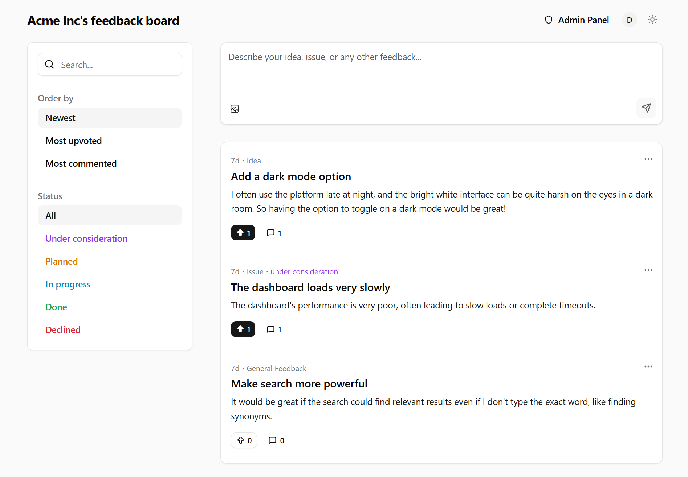
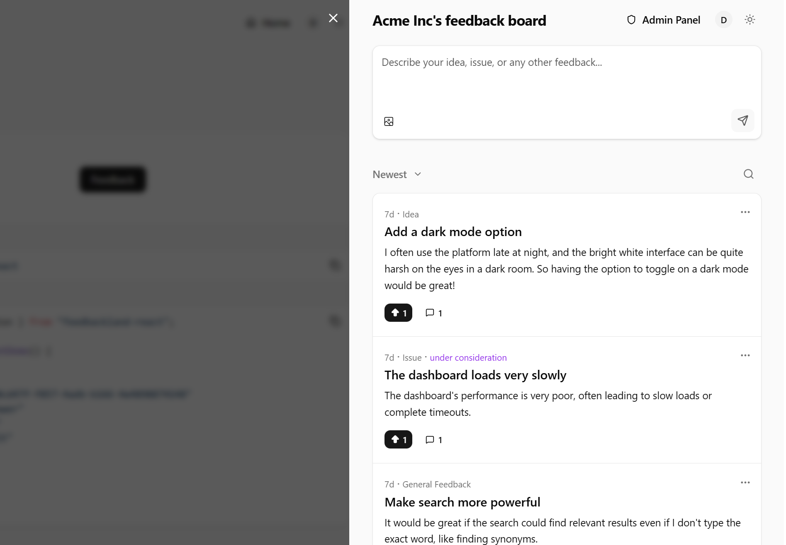
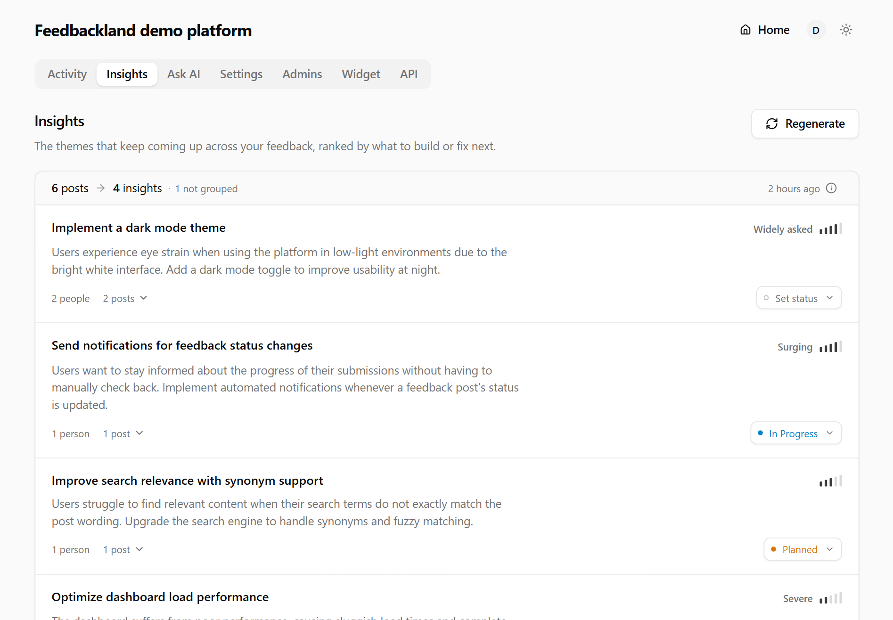

<div align="center">

# Feedbackland

**Self-hosted user feedback: an embeddable widget, a feedback board, and AI insights that tell you what to build next.**

<p>
  <a href="LICENSE"></a>
  <a href="https://www.npmjs.com/package/feedbackland-react"></a>
</p>

<p>
  <a href="SELFHOSTING.md">Get started</a> ·
  <a href="feedbackland-react/README.md">Widget docs</a>
</p>

</div>

<picture>
  <source media="(prefers-color-scheme: dark)" srcset="screenshots/homepage_dark_mode.png">
  
</picture>

## Run it yourself

Feedbackland is self-hosted. You run it, you own the data, and it needs one
thing: a Postgres database.

**Click a button** — no terminal, no Docker, nothing to install:

[](https://render.com/deploy?repo=https://github.com/feedbackland/feedbackland)

**Or run it with Docker**, if you'd rather:

```bash
curl -fsSL -o compose.yml https://raw.githubusercontent.com/feedbackland/feedbackland/main/compose.yml
docker compose up
```

Either way you'll be asked for four things — your product's name, your name,
your email and a password — and then your board is live.

[Full instructions →](SELFHOSTING.md)

## The widget

One component, one prop:

```bash
npm install feedbackland-react
```

```tsx
import { FeedbackButton } from "feedbackland-react";

<FeedbackButton url="https://feedback.yourcompany.com" />
```

That's the whole integration. It opens your full board in a slide-in drawer, or
a lightweight popover form. Style the button or bring your own.
[Widget docs →](feedbackland-react/README.md)

<picture>
  <source media="(prefers-color-scheme: dark)" srcset="screenshots/widget_opened_dark_mode.png">
  
</picture>

## AI insights

One click turns your whole board into a short, ranked list of underlying needs
— scored by reach, momentum, severity, and effort. Or just ask: a built-in chat
answers questions about your feedback.

This part is **optional and strongly recommended**. It works with a hosted
model for cents a month, or with a local model through
[Ollama](https://ollama.com) — free, open source, and nothing leaves your
machine. Your key stays on your server; we never see it, and nothing in
Feedbackland phones home. [How it works →](SELFHOSTING.md#turn-on-ai)

<picture>
  <source media="(prefers-color-scheme: dark)" srcset="screenshots/insights_dark_mode.png">
  
</picture>

## Open source, and yours

- **MIT-licensed** — fork it, run it, sell it.
- **No accounts, no telemetry, no phone-home.** There is no Feedbackland
  service; there is only your instance.
- **One `pg_dump` takes everything** — posts, comments, accounts and images —
  so moving or leaving is a restore away.

## License

[MIT](LICENSE)
